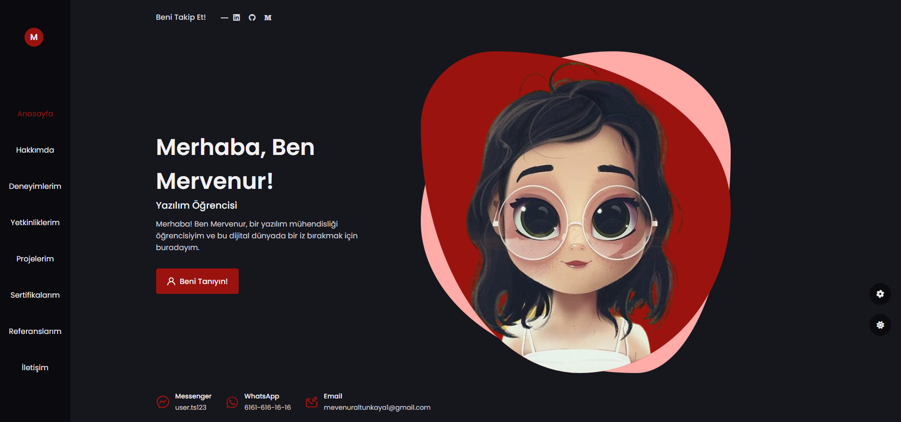

<h1>Admin Panelli Blog Web Sitesi</h1>

Bu proje, bir blog ve kişisel web sitesinin kaynak kodlarını içerir. Bu web sitesi, kullanıcının hakkında bilgi veren bir ana sayfa ve çeşitli bölümleri olan bir portföy sunar. Ayrıca, yönetici paneli aracılığıyla içeriklerin düzenlenebilmesi ve eklenmesi sağlanmıştır.

<h2>İçerikler</h2>

Web sitesi aşağıdaki ana bölümleri içerir:

1. Ana Sayfa

Ana sayfa, kullanıcının kısa bir tanıtımıyla başlar. Bu bölümde kullanıcı, ziyaretçilere kendisi hakkında genel bir fikir verir.

2. Hakkımda

Bu bölümde, kullanıcının eğitim ve deneyimi hakkında detaylı bilgiler bulunur. Kullanıcı, kariyer yolculuğunu ve profesyonel geçmişini paylaşır.

3. Yetkinlikler

Yetkinlikler bölümü, kullanıcının sahip olduğu becerileri ve uzmanlık alanlarını kategorilerine göre yüzdelikli olarak listeleyen bir kısım olarak tasarlanmıştır.

4. Projeler

Projeler bölümü, kullanıcının daha önce gerçekleştirdiği veya devam eden projeleri tanımlar. Her proje, bir açıklama ve kategorisiyle birlikte listelenir. Dilenirse projeler kategoriye göre filtrelenebilir.

5. Sertifikalar

Bu bölümde, kullanıcının aldığı sertifikalar ve eğitimleri listeler.

6. Referanslar

Referanslar bölümü, kullanıcının çalıştığı veya işbirliği yaptığı kişilerin veya kurumların referanslarına yer verir.

7. İletişim

İletişim bölümü, ziyaretçilerin kullanıcıyla iletişime geçebilmesi için iletişim bilgilerini sağlar ve bir iletişim formu bulundurur.

8. Yönetici Paneli

Yönetici paneli, web sitesinin içeriğini yönetmek için kullanılır. Buradan, içeriklerin düzenlenmesi, eklenmesi veya silinmesi sağlanır. Yönetici, bu panel aracılığıyla web sitesinin içeriğini güncelleyebilir.

<h2>Kurulum</h2>

Bu projeyi yerel makinenizde çalıştırmak için aşağıdaki adımları izleyebilirsiniz:

<h2>Gereksinimler:</h2>

XAMPP veya benzeri bir program: Apache sunucusu, MySQL veritabanı ve PHP sunucu ortamını içerir.
Bir metin düzenleyici: Kodları düzenlemek ve ayar dosyalarını yapılandırmak için. (VS Code...)

<h2>Projenin İndirilmesi: </h2>

Proje indirme veya klonlama işlemini gerçekleştirmek için aşağıdaki adımları inceleyin:

<h3>Projenin İndirilmesi (Download)</h3>

1. Sağ üst köşedeki yeşil renkli "Code" butonuna tıklayın.
2. Açılan menüden "Download ZIP" seçeneğine tıklayarak projeyi bilgisayarınıza indirin.

<h3>Projenin Klonlanması (Clone)</h3>

Projeyi klonlamak için, Git yazılımını kullanmanız gerekecektir. Eğer bilgisayarınızda Git yüklü değilse, [Git'in resmi web sitesinden](https://git-scm.com/) indirip yükleyebilirsiniz.

1. Terminal veya Git Bash gibi bir komut satırı aracını açın.
2. Projeyi klonlamak istediğiniz dizine gidin:
   ```javascript
   cd path/to/your/directory
   ```
3. Projenin GitHub deposunun URL'sini kullanarak projeyi klonlayın:
   ```javascript
   git clone https://github.com/mervenuraltunkaya/Admin-Panelli-Blog-Sitesi
   ```

Bu komutlar, GitHub'dan projenin dosyalarını bilgisayarınıza indirecek ve belirlediğiniz dizine kopyalayacaktır. Artık projenin dosyalarını bilgisayarınızda kullanabilirsiniz.

<h2>Veritabanı Ayarları: </h2>

XAMPP kontrol panelini kullanarak bir MySQL veritabanı oluşturun.

<h4>Proje Yapılırken Oluşturulan Veritabanı: blog </h4>

-admin (id:int, kullanici_adi:text, sifre:text)

-anasayfa (id:int, icerik:text, hakkimda:text, linkedin:text, github:text, medium:text)

-deneyim (id:int, kurum_adi:text, yil:text, pozisyon:text)

-egitim (id:int, kurum_adi:text, bas_tarih:int, bit_tarih:int)

-iletisim (id:int, adSoyad:text, email:text, mesaj:text)

-proje (id:int, proje_adi:text, proje_turu:text, proje_acikama:longtext, fotograf:blob)

-referans (id:int, adSoyad:text, gorev:text, gorus:text)

-sertifika (id:int, sertifika_adi:text, fotograf:blob)

-yetkinlik (id:int, yetkinlik_adi:text, yuzde:float, kategori:text)

<h2>Yönetici Girişi: </h2>

Projenin içinde bulunan yönetici paneline erişmek için bir kullanıcı adı ve şifre belirleyin.

<h2>Projeyi Çalıştırma: </h2>

XAMPP veya benzeri programı çalıştırın. (XAMPP için Apache ve MySQL çalışmalı.)
Tarayıcınızda projenin klasörünün yolunu ziyaret ederek web sitesini görüntüleyin. (Örneğin: http://localhost/WebSiteGuncel/index.php)

<h2>Proje İçeriğinden Görseller: </h2>


